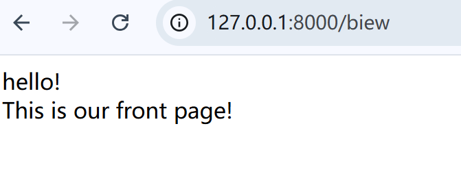

# 说明 / summary

本次更新对返回视图的方式进行了优化

This update optimizes the way to return Views

## 视图类的定义 / definition of View Class

| Modifier and Type | Method                    | Description           |
|-------------------|---------------------------|-----------------------|
| Biew              | Biew(String relativePath) | 根据文件的相对路径创建一个新的Biew对象 |
| String            | parse()                   | 将目标文件的内容读取为字符串        |

## 使用示例 / Examples

### 1.create HTML file

在 `src/main/resources` 目录下创建 `home.html` 文件，并在其中添加我们想要展示的html格式的内容： 

create a file `homt.html` in the `src/main/resources` directory , add the HTML content we want to display in it:

```html
<html lang="en">
<head>
    <title>Hello!</title>
</head>
<body>
<div>hello!</div>
<div>This is our front page!</div>
</body>
</html>
```

### 2.为页面创建处理器 / create request handler for the View

```java
public class BiewHandler implements RequestHandler<Void> {
    @Override
    public Object doHandle(HttpRequest<Void> httpRequest) {
        // now we can use the Biew class to return the page immediately
        return new Biew("home.html");
    }

    @Override
    public String getUrl() {
        return "/biew";
    }
}
```

### 3.将处理器添加到客户端 / add handler to our client

```java
public class Main {
    public static void main(String[] args) throws IOException {
        WebClient.build().bind(8000)
                .addPreMiddleware(new AuthInterceptor())
                .addHandler(new FrontPageHandler())
                .addHandler(new PrivateHandler())
                // add the BiewHandler
                .addHandler(new BiewHandler())
                .listen();
    }
}
```

### 4.检查页面是否正确显示 / check the page 

