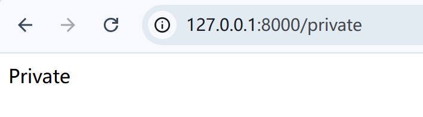
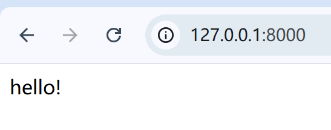
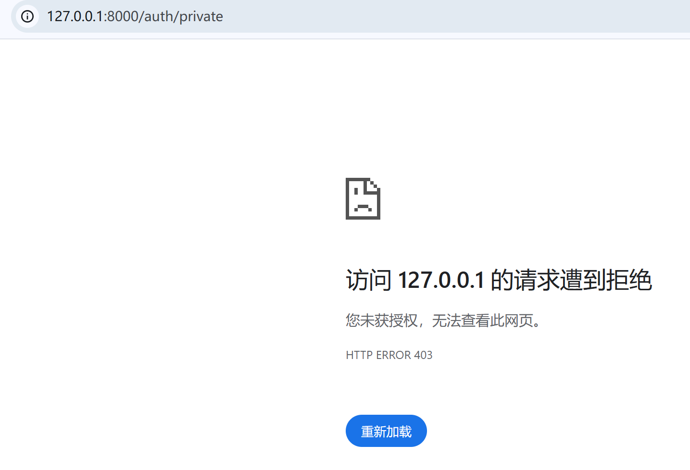

# 首页和登录 / front page and login

## 此子项目的目的 / purpose of this subproject

示范和验证 `WebClient` 对于 `GET`,`POST` 请求以及拦截器的支持 

demonstrate and verify the `WebClient` developed by us can support `GET`,`POST` request and interceptors.

## 1 监听端口 / listen on a port

```java
public class Main {
    public static void main(String[] args) throws IOException {
        WebClient.build().bind(8000)
                .listen();
    }
}
```

## 2 处理器 / handler

### 2.1 首页 / front page

创建`FrontPageHandler`类，实现`RequestHandler`接口：

create class `FrontPageHandler` and implements interface `RequestHandler`

```java
public class FrontPageHandler implements RequestHandler<Void> {
    @Override
    public Object doHandle(HttpRequest<Void> httpRequest) {
        return """
                <html lang="en">
                <head>
                    <title>Hello!</title>
                </head>
                <body>
                    <div>hello!</div>
                </body>
                </html>""";
    }

    @Override
    public String getUrl() {
        return "/";
    }
}

```

访问 `127.0.0.1:8000/` :

visit `127.0.0.1:8000/`


### 2.2 个人页面 /private page

创建个人页面处理器：

create the handler for private page:

```java
public class PrivateHandler implements RequestHandler<Void> {
    @Override
    public Object doHandle(HttpRequest<Void> httpRequest) {
        return """
                <html lang="en">
                <head>
                    <title>Private!</title>
                </head>
                <body>
                    <div>Private</div>
                </body>
                </html>""";
    }

    @Override
    public String getUrl() {
        return "/private";
    }
}

```

添加到`WebClient`:

add it to webClient:

org.example.Main
```java
public class Main {
    public static void main(String[] args) throws IOException {
        WebClient.build().bind(8000)
                .addHandler(new FrontPageHandler())
                // add private handler
                .addHandler(new PrivateHandler())
                .listen();
    }
}
```

浏览器访问 `127.0.0.1:8000/private` :

visit `127.0.0.1:8000/private` in browser:



## 3 身份验证 / authentication

### 3.1 身份验证策略 / authentication strategy

对于需要身份验证的资源，他们的url我们一律以 `/auth` 为首

for resources that require authentication, we make their url start with a prefix `/auth`

### 3.2 身份验证拦截器 / authentication interceptor

创建身份验证拦截器，实现 `MiddlewareHandler` 接口：

create an AuthInterceptor that implements the MiddlewareHandler

```java
public class AuthInterceptor implements MiddlewareHandler {
    @Override
    public boolean handle(HttpRequest<?> httpRequest, HttpResponseBuilder response) {
        String path = httpRequest.getPath();
        if (path.startsWith("/auth/")){
            String user = httpRequest.getHeaders().get("user");
            // 检查请求头中有无用户名
            // check whether user exist in headers or not
            if (StringUtils.isEmpty(user)) {
                response.statusCode(403).reasonPhrase("Forbidden");
                return false;
            }
        }
        // 放行 pass
        return true;
    }
}

```

添加到前置处理器：

add it to pre handlers:

```java
public class Main {
    public static void main(String[] args) throws IOException {
        WebClient.build().bind(8000)
                // add the AuthInterceptor
                .addPreMiddleware(new AuthInterceptor())
                .addHandler(new FrontPageHandler())
                .addHandler(new PrivateHandler())
                .listen();
    }
}
```

修改 `PrivateHandler` 的 `url` :

modify the url of `PrivateHandler` :

```java
public class PrivateHandler implements RequestHandler<Void> {
//    omit detail
    @Override
    public String getUrl() {
        return "/auth/private";
    }
}

```

重启程序，现在我们依然可以访问首页 `127.0.0.1:8000/`，但访问 `127.0.0.1:8000/auth/private` 会被拦截：

restart the program, now we can visit the front page `127.0.0.1:8000/`, but if we visit the `127.0.0.1:8000` we will be intercepted




